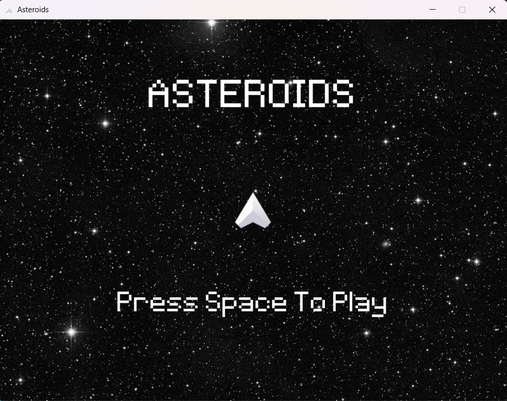
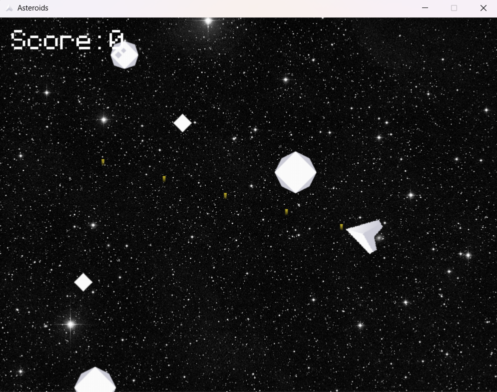
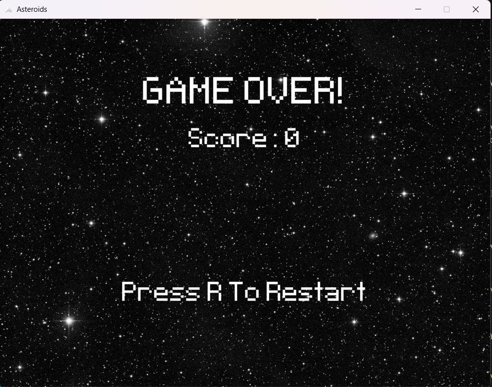

# Asteroids

A recreation of the classic **Asteroids** arcade game built with **Python** and **Pygame**.

# Features
- Ship movement with inertia
- Screen wrapping
- Asteroid splitting
- Pixel-perfect collisions
- Sound effects and background music
- Score system
- Restart menu

## Screenshots

### Main Menu



### Gameplay



### Game Over



## Controls

| Key | Action |
|------|--------|
| ↑ | Thrust |
| ← → | Rotate |
| Space | Shoot |
| R | Restart (Game Over screen) |

## Installation

```bash
git clone https://github.com/polestarchill/Asteroids.git
cd Asteroids
pip install pygame
python main.py
```

> Replace `main.py` with your filename if its different

 
### Art
- Kenney — Simple Space / Space Shooter assets

### Sound Effects
- Based on the original Asteroids arcade game sounds, obtained from Classic Gaming.

### Music
- Background music from the Hat-Tap Asteroids asset pack on itch.io.

